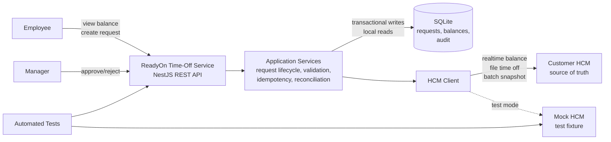
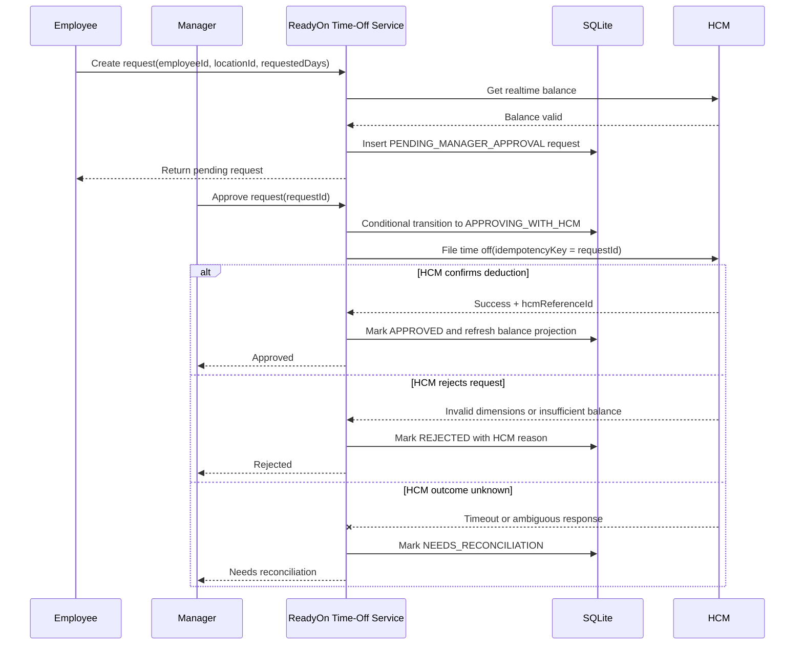

# Technical Requirements Document: Time-Off Microservice

## 1. Overview

ReadyOn needs a backend microservice that manages employee time-off requests while keeping balances aligned with the customer's Human Capital Management (HCM) system. HCM remains the source of truth, while ReadyOn provides the employee and manager workflow for viewing balances, submitting requests, approving requests, and syncing balance changes.

## 2. Functional Requirements

- Employees must be able to view an accurate time-off balance for their `employeeId` and `locationId`.
- Employees must be able to submit a time-off request for a specific `employeeId`, `locationId`, and requested number of days.
- Employees must receive clear feedback when a request cannot be accepted because of insufficient balance, invalid dimensions, or unavailable validation.
- Managers must be able to review, approve, or reject employee time-off requests.
- Managers must be able to approve requests with confidence that the balance and dimensions are still valid at the time of approval.
- The service must manage the lifecycle of a time-off request from creation through approval, rejection, filing with HCM, or failure.
- The service must keep ReadyOn's view of time-off balances aligned with HCM when balances change outside of ReadyOn.
- The service must integrate with HCM APIs for checking balances and sending time-off values.
- The service must handle HCM errors for invalid dimension combinations and insufficient balances.
- The service must remain defensive when HCM does not reliably return expected validation errors.
- The service must assume balances are scoped per employee and per location.

## 3. Non-Functional Requirements

- Source of truth: HCM is authoritative for employment data and time-off balances.
- Consistency: Operations that consume or reserve balance must fail closed when authoritative validation is unavailable or ambiguous.
- Concurrency: Concurrent approvals for the same `employeeId` and `locationId` must not allow the effective balance to become negative.
- Idempotency: Retried write requests must not create duplicate time-off requests, repeat approvals, or double-file deductions to HCM.
- Atomicity: Request status changes and local balance updates must be committed transactionally where they are part of the same local decision.
- Auditability: Request decisions, HCM calls, and balance sync events must be traceable by request ID and employee/location dimensions.
- Testability: The implementation must include automated coverage for HCM success, HCM failure, stale balance, concurrency, and idempotent retry scenarios.

## 4. Non-Goals

- Building employee or manager frontend UI.
- Implementing payroll, accrual policy calculation, or full employee profile management.
- Supporting multiple HCM vendors through a generalized adapter framework.
- Building production-grade authentication, authorization, or background job infrastructure.

## 5. Assumptions

- HCM is the source of truth for employee time-off balances.
- Balances are scoped by `employeeId` and `locationId`.
- Time-off values are represented in days.
- HCM exposes realtime endpoints for checking balances and filing time-off deductions.
- HCM exposes a batch endpoint that can provide the full balance corpus to ReadyOn.
- HCM may return errors for invalid dimensions or insufficient balance, but these errors are not guaranteed to be complete or reliable.
- ReadyOn may receive or observe balance changes that originated outside ReadyOn.
- The implementation will use NestJS and SQLite, per the exercise guidance.
- A mock HCM service will be implemented as part of the test suite; it is not a production component.

## 6. System Architecture



The solution is a NestJS backend service backed by SQLite. The service exposes ReadyOn-facing APIs, stores request lifecycle state locally, and calls HCM through an isolated client. HCM remains the source of truth for balance-consuming decisions.

### Components

- API layer: REST controllers for balances, request creation, manager decisions, and sync operations.
- Application services: Request lifecycle, validation, HCM filing, idempotency, and reconciliation logic.
- SQLite persistence: Time-off requests, balance projections, and audit events.
- HCM client: Adapter for HCM realtime balance, file-time-off, and batch snapshot endpoints.
- Mock HCM service: Test fixture that simulates successful HCM behavior, validation failures, balance drift, bad responses, and outages.

### Approval Architecture Options

The critical architecture decision is how to coordinate a local request state change with the external HCM deduction.

| Option                                                          | Flow                                                                                                                    | Pros                                                                                                                      | Cons                                                                                           |
| --------------------------------------------------------------- | ----------------------------------------------------------------------------------------------------------------------- | ------------------------------------------------------------------------------------------------------------------------- | ---------------------------------------------------------------------------------------------- |
| A. HCM first, then local DB                                     | File deduction in HCM, then mark request approved locally.                                                              | HCM is updated before ReadyOn reports approval.                                                                           | If HCM succeeds and the local DB write fails, ReadyOn may lose track of an approved deduction. |
| B. Local `APPROVING_WITH_HCM`, then HCM, then final local state | Persist the in-progress request state, call HCM, then mark approved/rejected/reconciliation-needed based on the result. | Durable record that HCM filing started; avoids marking approved before HCM confirms; supports retries and reconciliation. | Requires intermediate states and reconciliation for unknown HCM outcomes.                      |
| C. Transactional outbox worker                                  | Persist an outbox event locally and let a worker file the deduction to HCM asynchronously.                              | Strong production pattern with retry control and decoupling.                                                              | More infrastructure and operational complexity than needed for this exercise.                  |

This design uses **Option B**. A manager approval first moves the request to `APPROVING_WITH_HCM` in the local database. The service then calls HCM with the ReadyOn request ID as the idempotency/correlation key. Only after HCM confirms the deduction does ReadyOn mark the request `APPROVED`. If HCM rejects the deduction, the request becomes `REJECTED`. If the HCM outcome is unknown, the request becomes `NEEDS_RECONCILIATION`.

Requests in `NEEDS_RECONCILIATION` are recoverable because the ReadyOn request ID is used as the HCM idempotency/correlation key. A reconciliation process can later query HCM to determine whether the deduction was applied and then repair the local request state. These cases should also produce structured logs, audit events, and alerts because they represent user-visible uncertainty in the approval flow.

### Consistency Boundary

Approval is the critical consistency boundary. Local balance data may support reads and reconciliation, but it is not the sole authority for approving or filing a balance-consuming request.

### Balance Sync Options

HCM provides both realtime balance APIs and a batch endpoint for the full balance corpus. ReadyOn uses these feeds to maintain a non-authoritative local balance view.

| Option                           | Flow                                                                                                                   | Pros                                                                                                | Cons                                                                                                           |
| -------------------------------- | ---------------------------------------------------------------------------------------------------------------------- | --------------------------------------------------------------------------------------------------- | -------------------------------------------------------------------------------------------------------------- |
| A. Full table rewrite            | Delete the current projection and insert the full HCM snapshot.                                                        | Simple to reason about.                                                                             | Can expose partial/empty data if not carefully transaction-wrapped; high write amplification.                  |
| B. Changed-row projection upsert | Compare incoming rows to `balance_projections` and write only new or changed balances.                                 | Simple schema; lower write volume than blind rewrite; works well with explicit single-balance sync. | Current projection may contain stale rows that disappear from HCM unless separately marked inactive.           |
| C. Versioned snapshot pointer    | Insert the full corpus into immutable snapshot tables, validate it, then atomically switch an active snapshot pointer. | Consistent reads, easy rollback, strong fit for full-corpus HCM batches.                            | More tables, more storage, cleanup complexity, and less natural support for single-balance realtime refreshes. |

This design uses **Option B** for the exercise. Batch sync performs transactional changed-row upserts into `balance_projections`, while explicit single-balance sync uses the realtime HCM API to refresh one employee/location. A production system with very large tenants could move to **Option C** to reduce partial-sync risk and improve rollback semantics.

## 7. Data Model

The minimal model uses three tables: one for request lifecycle state, one for ReadyOn's latest known HCM balance projection, and one for auditability.

### `time_off_requests`

Represents the ReadyOn lifecycle of a time-off request and the latest HCM filing attempt.

| Field                    | Notes                                                           |
| ------------------------ | --------------------------------------------------------------- |
| `id`                     | ReadyOn request ID.                                             |
| `employeeId`             | Employee dimension.                                             |
| `locationId`             | Location dimension.                                             |
| `requestedDays`          | Number of time-off days requested.                              |
| `status`                 | Current lifecycle status.                                       |
| `rejectionReason`        | Optional reason when `status = REJECTED`.                       |
| `managerRejectionNote`   | Optional manager-entered note for manager rejections.           |
| `createIdempotencyKey`   | Prevents duplicate request creation on retry.                   |
| `hcmReferenceId`         | Optional HCM confirmation/reference ID after successful filing. |
| `lastHcmErrorCode`       | Optional sanitized HCM error code.                              |
| `lastHcmCheckedAt`       | Last time ReadyOn checked HCM for this request.                 |
| `createdAt`, `updatedAt` | Audit timestamps.                                               |

Request creation uses a client-provided idempotency key because the request ID does not exist yet. Approval and HCM filing use the ReadyOn `id` as the idempotency and correlation key because each request can be approved and filed at most once.

Request statuses:

- `PENDING_MANAGER_APPROVAL`: Request passed creation-time validation and is waiting for a manager decision.
- `APPROVING_WITH_HCM`: Manager approval started and HCM filing is in progress.
- `APPROVED`: HCM confirmed the deduction.
- `REJECTED`: Request was rejected by the manager or by HCM validation.
- `NEEDS_RECONCILIATION`: HCM outcome is unknown and must be reconciled before the request can be considered final.

Rejection reasons:

- `MANAGER_REJECTED`
- `HCM_INVALID_DIMENSIONS`
- `HCM_INSUFFICIENT_BALANCE`
- `HCM_VALIDATION_FAILED`

### `balance_projections`

Stores ReadyOn's latest known view of HCM balances.

| Field           | Notes                                           |
| --------------- | ----------------------------------------------- |
| `employeeId`    | Employee dimension.                             |
| `locationId`    | Location dimension.                             |
| `availableDays` | Latest known available balance.                 |
| `source`        | `REALTIME_HCM` or `BATCH_HCM`.                  |
| `lastSyncedAt`  | When ReadyOn last synced this balance from HCM. |
| `updatedAt`     | Local update timestamp.                         |

The unique key is `employeeId + locationId`. This table is a projection of HCM state, not an authoritative ledger.

### `audit_events`

Provides a trace of important request, HCM, and sync decisions.

| Field                      | Notes                                                                        |
| -------------------------- | ---------------------------------------------------------------------------- |
| `id`                       | Audit event ID.                                                              |
| `requestId`                | Optional related request.                                                    |
| `employeeId`, `locationId` | Optional dimensions for querying.                                            |
| `eventType`                | Example: `REQUEST_CREATED`, `HCM_FILE_SUCCEEDED`, `RECONCILIATION_REQUIRED`. |
| `payload`                  | Structured event details.                                                    |
| `createdAt`                | Event timestamp.                                                             |

Production versions may split generic idempotency handling or HCM filing attempts into separate tables. For this exercise, the request row and audit log are sufficient because each request has a single manager approval path.

## 8. API Design

The service exposes REST endpoints. Write endpoints use explicit request bodies and return the resulting request state.

### ReadyOn API

| Method | Path                                                        | Purpose                                                                             |
| ------ | ----------------------------------------------------------- | ----------------------------------------------------------------------------------- |
| `GET`  | `/balances?employeeId={employeeId}&locationId={locationId}` | Return ReadyOn's latest synced balance projection with `lastSyncedAt`.              |
| `POST` | `/balances/sync`                                            | Explicitly refresh one employee/location balance from HCM realtime API.             |
| `POST` | `/time-off-requests`                                        | Create a time-off request after validating employee/location and balance.           |
| `GET`  | `/time-off-requests/{requestId}`                            | Return the current request state.                                                   |
| `POST` | `/time-off-requests/{requestId}/approve`                    | Manager approval. Transitions the request through HCM filing.                       |
| `POST` | `/time-off-requests/{requestId}/reject`                     | Manager rejection. Does not call HCM.                                               |
| `POST` | `/time-off-requests/{requestId}/reconcile`                  | Re-check HCM for a request in `NEEDS_RECONCILIATION` or stalled `APPROVING_WITH_HCM`. |
| `POST` | `/hcm-sync/balances`                                        | Internal endpoint to ingest a batch HCM balance snapshot into the local projection. |

Balance reads return ReadyOn's latest synced projection. Balance-consuming operations, such as request creation and approval, perform their own HCM validation regardless of the projection's `lastSyncedAt`.

### Sync Single Balance

`POST /balances/sync`

Request:

```json
{
  "employeeId": "emp_123",
  "locationId": "loc_001"
}
```

Response:

```json
{
  "employeeId": "emp_123",
  "locationId": "loc_001",
  "availableDays": 10,
  "source": "REALTIME_HCM",
  "lastSyncedAt": "2026-05-17T13:00:00Z"
}
```

### Create Time-Off Request

`POST /time-off-requests`

Headers:

- `Idempotency-Key`: required for duplicate-safe request creation.

Request:

```json
{
  "employeeId": "emp_123",
  "locationId": "loc_001",
  "requestedDays": 2
}
```

Response:

```json
{
  "id": "tor_123",
  "employeeId": "emp_123",
  "locationId": "loc_001",
  "requestedDays": 2,
  "status": "PENDING_MANAGER_APPROVAL"
}
```

### Approve Time-Off Request

`POST /time-off-requests/{requestId}/approve`

Approval uses `requestId` as the HCM idempotency and correlation key. The endpoint returns the final state when HCM returns a definitive response. If the HCM outcome is unknown, it returns `NEEDS_RECONCILIATION`.

Possible responses:

- `APPROVED`: HCM confirmed the deduction.
- `REJECTED`: HCM rejected the filing because of invalid dimensions or insufficient balance.
- `NEEDS_RECONCILIATION`: HCM outcome could not be determined.

### Reject Time-Off Request

`POST /time-off-requests/{requestId}/reject`

Request:

```json
{
  "reason": "Manager rejected request"
}
```

Response status is `REJECTED` with `rejectionReason = MANAGER_REJECTED` and the optional note echoed as `managerRejectionNote`.

### Batch Balance Sync

`POST /hcm-sync/balances`

Receives a batch snapshot from HCM or the mock HCM and upserts `balance_projections` by `employeeId + locationId`.

Request:

```json
{
  "balances": [
    {
      "employeeId": "emp_123",
      "locationId": "loc_001",
      "availableDays": 10
    }
  ]
}
```

### Error Shape

Errors use a consistent response shape:

```json
{
  "code": "INSUFFICIENT_BALANCE",
  "message": "Requested days exceed available balance.",
  "requestId": "tor_123"
}
```

## 9. Request Lifecycle



## 10. Consistency Rules

HCM is the final authority for balance-consuming operations. ReadyOn's local balance projection supports reads and sync visibility, but it cannot authorize a request by itself.

- Reads may use the latest synced projection and must include `lastSyncedAt`.
- Request creation and approval must validate against HCM realtime data.
- Approval must file the deduction in HCM before ReadyOn marks the request `APPROVED`.
- ReadyOn prevents duplicate local approvals with conditional state transitions.
- HCM must be the final atomic gate for global balance deduction because other systems can update HCM outside ReadyOn.
- Unknown HCM outcomes move requests to `NEEDS_RECONCILIATION` instead of assuming success or failure.
- SQLite transaction sections are serialized inside the service process to avoid overlapping savepoint behavior on the single local SQLite connection used by the exercise runtime.

## 11. Failure Modes

| Scenario                                                    | Handling                                                                                            |
| ----------------------------------------------------------- | --------------------------------------------------------------------------------------------------- |
| HCM rejects request creation for invalid dimensions         | Do not create request; return validation error.                                                     |
| HCM rejects request creation for insufficient balance       | Do not create request; return insufficient balance error.                                           |
| HCM is unavailable during request creation                  | Fail closed; do not create request from local projection alone.                                     |
| Manager rejects pending request                             | Mark `REJECTED` with `MANAGER_REJECTED`; do not call HCM.                                           |
| HCM rejects approval for invalid dimensions                 | Mark `REJECTED` with `HCM_INVALID_DIMENSIONS`.                                                      |
| HCM rejects approval for insufficient balance               | Mark `REJECTED` with `HCM_INSUFFICIENT_BALANCE`.                                                    |
| HCM times out or returns ambiguous response during approval | Mark `NEEDS_RECONCILIATION`; alert and retry reconciliation.                                        |
| Service crashes after local approval starts but before a final HCM outcome is recorded | Leave the durable `APPROVING_WITH_HCM` state recoverable through reconciliation. |
| Same request is approved twice                              | Conditional transition allows only one `PENDING_MANAGER_APPROVAL -> APPROVING_WITH_HCM` transition. |
| Client retries request creation                             | Same `Idempotency-Key` returns the original request instead of creating a duplicate.                |
| Local balance projection is stale                           | Balance-consuming operations still validate with HCM realtime.                                      |
| Batch sync fails partway through                            | Transaction rolls back; previous projection remains active.                                         |

## 12. Test Strategy

The test suite is the main proof of correctness. It uses an end-to-end suite against SQLite and a mock HCM service for the critical workflows, plus a small unit smoke test for the health controller.

Test coverage should include:

- Request creation succeeds when HCM confirms valid dimensions and sufficient balance.
- Request creation fails when HCM reports invalid dimensions or insufficient balance.
- Request creation fails closed when HCM is unavailable.
- Manager rejection transitions a pending request to `REJECTED` without calling HCM.
- Manager rejection preserves the optional manager-entered note.
- Manager approval transitions through `APPROVING_WITH_HCM` and becomes `APPROVED` only after HCM confirms.
- HCM rejection during approval maps to `REJECTED` with the correct rejection reason.
- HCM timeout during approval maps to `NEEDS_RECONCILIATION`.
- Reconciliation marks unknown requests approved when HCM confirms the deduction.
- Reconciliation returns unknown requests to pending when HCM confirms no deduction occurred.
- Retried create requests with the same idempotency key do not create duplicates.
- Retried approvals do not double-file to HCM.
- Concurrent approval attempts for the same request result in only one HCM filing attempt.
- Concurrent approval attempts for separate requests on the same employee/location cannot overdraw the HCM balance.
- Stalled `APPROVING_WITH_HCM` requests can be reconciled when no HCM filing exists.
- Batch sync updates changed balances and leaves unchanged rows untouched.
- Balance-consuming operations ignore stale local projections and use HCM realtime validation.

Coverage proof will be generated with `npm run test:cov`.

## 13. Operational Concerns

- Auditability: Request creation, manager decisions, HCM filing results, sync operations, and reconciliation outcomes are written to `audit_events`.
- Observability: `NEEDS_RECONCILIATION`, repeated HCM failures, and batch sync failures should emit structured logs and alerts.
- Validation: API inputs are validated for required dimensions, positive requested days, and valid request state transitions.
- Security: Authentication and authorization are assumed at the API boundary for the exercise; production would enforce employee access to own balances and manager-only approval/rejection.
- Data sensitivity: HCM payloads are not stored wholesale. The service stores only sanitized error codes, HCM references, and audit metadata.
- Persistence: SQLite is acceptable for the take-home. Production would use a database with stronger concurrency controls and operational tooling.

## 14. Future Work

- Background reconciliation scheduler for `NEEDS_RECONCILIATION`.
- Transactional outbox and retry worker for HCM filing.
- Versioned balance snapshots for large tenant batch syncs.
- Multi-HCM adapter layer.
- Production authentication, authorization, and tenant isolation.
- Incremental HCM webhooks or change feeds if supported by HCM vendors.
